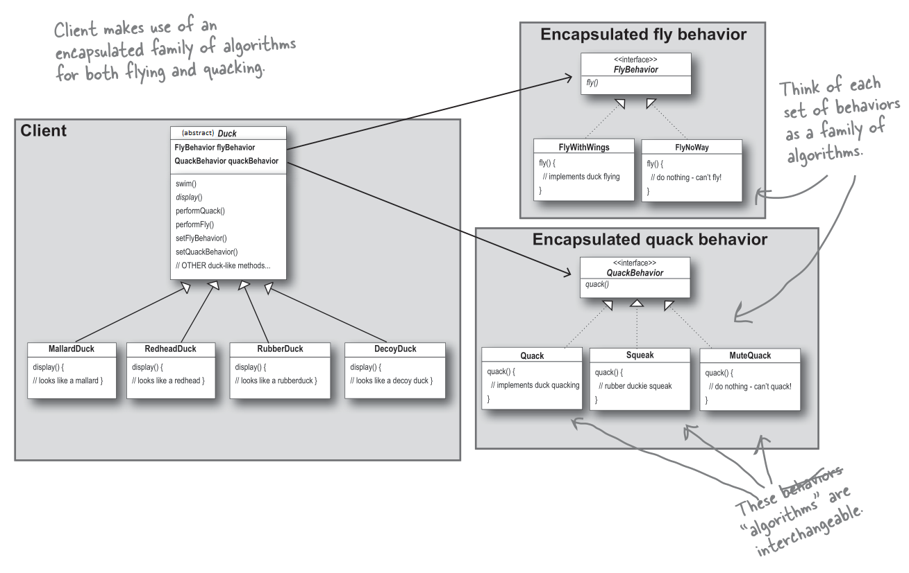
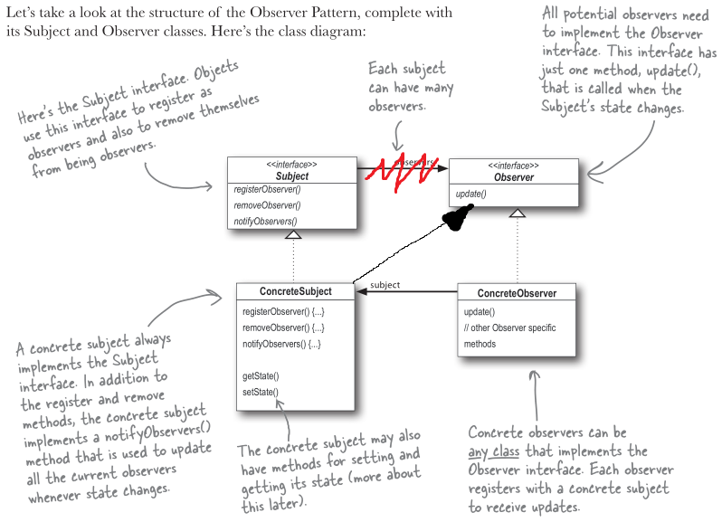
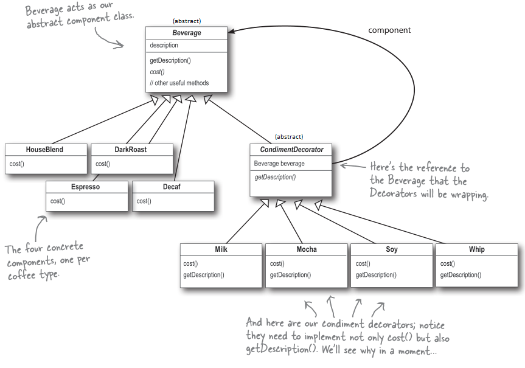
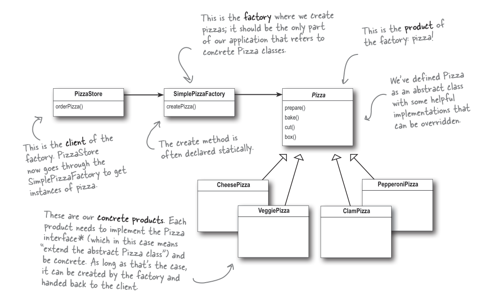

# [Head First Design Patterns](https://www.oreilly.com/library/view/head-first-design/0596007124/)
_Eric Freeman & Elisabeth Freeman, with Kathy Sierra & Bert Bates_

Studying patterns based on the book Head First Design Patterns 2nd Edition ([book included in the resources folder](recources/freeman_eric_robson_elisabeth_head_first_design_patterns_bui.pdf))


# [The Strategy Pattern](https://github.com/realtehcman/DesignPatternsEricFreeman/blob/master/1strategy)

| categories | tags|
|---------   |--------|
| Bahavioral | Gang of Four|



## Quick Overview
    
- prefer HAS-A over IS-A relationship
- extract algorithms (behaviors, interfaces) and put them into fields (has a relationship)
    
    *this way we*
    
    - interface is basically a place holder to be implemented by an concrete method from a class
    - we reuse some algorithms
    - we solve problem with the code duplication that happens with inheritance
            
- perform dependency injection
        
    - it dynamically sets the implementation of those algorithms

## Also known as

Policy

## Intent

Define a family of algorithms, encapsulate each one, and make them interchangeable. Strategy lets 
the algorithm vary independently from the clients that use it.

## Explanation

Real-world example

> Slaying dragons is a dangerous job. With experience, it becomes easier. Veteran 
> dragonslayers have developed different fighting strategies against different types of dragons.         

In plain words

> Strategy pattern allows choosing the best-suited algorithm at runtime.   

Wikipedia says

> In computer programming, the strategy pattern (also known as the policy pattern) is a behavioral 
> software design pattern that enables selecting an algorithm at runtime.


## Applicability

Use the Strategy pattern when

* Many related classes differ only in their behavior. Strategies provide a way to configure a class either one of many behaviors
* You need different variants of an algorithm. for example, you might define algorithms reflecting different space/time trade-offs. Strategies can be used when these variants are implemented as a class hierarchy of algorithms
* An algorithm uses data that clients shouldn't know about. Use the Strategy pattern to avoid exposing complex algorithm-specific data structures
* A class defines many behaviors, and these appear as multiple conditional statements in its operations. Instead of many conditionals, move the related conditional branches into their own Strategy class


# [The Observer Pattern](https://github.com/realtehcman/DesignPatternsEricFreeman/blob/master/2observer/weather_station)

| categories | tags|
|---------   |--------|
| Bahavioral | Gang of Four, Reactive|



## Quick Overview
- glossary
    - in the book they actively use “subject”, yet, in my examples I use observable for the clearer understanding. “Observable” is observed by an “Observer”
- when to use
    - subscriptions
    - notify listeners on updates
- one to many relationships
    - observable can have many observers
- observers may be also observables
- objects in the pattern
    - Observable; gets changes and notifies an observer
    - Observer; pulls changes when notified
- we implement the push pull behavior. Observable pushes, and observer pulls the changes  
    - IObservable has couple methods: add(), remove(), notify(),
    - Observable : IObservable has getTemparature() and other additional methods, and has ***IObserver*** object  
    
    - IObserver has update method
    - Observer : IObserver and has ***Observable*** object
        - what if we want to implement the push push behavior. 
            - Observable notifies and pushes update, and observer has update(Observable object) method

## Also known as

Dependents, ~~Publish-Subscribe~~

## Intent

Define a one-to-many dependency between objects so that when one object changes state, all its 
dependents are notified and updated automatically.

## Explanation

Real-world example

> In a land far away live the races of hobbits and orcs. Both of them are mostly outdoors so they 
> closely follow the weather changes. One could say that they are constantly observing the 
> weather.

In plain words

> Register as an observer to receive state changes in the object.

Wikipedia says

> The observer pattern is a software design pattern in which an object, called the subject, 
> maintains a list of its dependents, called observers, and notifies them automatically of any state 
> changes, usually by calling one of their methods.


## Applicability

Use the Observer pattern in any of the following situations:

* When an abstraction has two aspects, one dependent on the other. Encapsulating these aspects in 
separate objects lets you vary and reuse them independently.
* When a change to one object requires changing others, and you don't know how many objects need to 
be changed.
* When an object should be able to notify other objects without making assumptions about who these 
objects are. In other words, you don't want these objects tightly coupled.

# [The Decorator Pattern](https://github.com/realtehcman/DesignPatternsEricFreeman/blob/master/3decorator/starbuzz_coffee)
| categories | tags|
|---------   |--------|
| Structural | Gang of Four, Extensibility|




## Quick Overview


[Strategy Pattern V/S Decorator Pattern](https://stackoverflow.com/questions/26422884/strategy-pattern-v-s-decorator-pattern)  
> It boils down to this: Use Strategy to choose one piece of core functionality. Use Decorator to add extra functionality. Strategy is the cake we're making and Decorator is all the pretty decorations we're adding to it.

- how it works
    - think about the recursion
    - we have abstract component (could be interface) and concrete component implementations; we have the abstract decorator that has and inherits from the abstract component
    - we have many concrete decorators that extends abstract decorator and wrap the component; each of the concrete decorator get the price from the component with the `super.`**added** amount, and return the `super.` **concatenated** description

## Also known as

Wrapper

## Intent

Attach additional responsibilities to an object dynamically. Decorators provide a flexible 
alternative to subclassing for extending functionality.

## Explanation

Real-world example

> There is an angry troll living in the nearby hills. Usually, it goes bare-handed but sometimes it 
> has a weapon. To arm the troll it's not necessary to create a new troll but to decorate it 
> dynamically with a suitable weapon.

In plain words

> Decorator pattern lets you dynamically change the behavior of an object at run time by wrapping 
> them in an object of a decorator class.

Wikipedia says

> In object-oriented programming, the decorator pattern is a design pattern that allows behavior to 
> be added to an individual object, either statically or dynamically, without affecting the behavior 
> of other objects from the same class. The decorator pattern is often useful for adhering to the 
> Single Responsibility Principle, as it allows functionality to be divided between classes with 
> unique areas of concern.

## Applicability

Decorator is used to:

* Add responsibilities to individual objects dynamically and transparently, that is, without 
affecting other objects.
* For responsibilities that can be withdrawn.
* When extension by subclassing is impractical. Sometimes a large number of independent extensions 
are possible and would produce an explosion of subclasses to support every combination. Or a class 
definition may be hidden or otherwise unavailable for subclassing.


# [The Factory Pattern](https://github.com/realtehcman/DesignPatternsEricFreeman/blob/master/4factory/shape)
## The Simple Factory

|categories | tags |
|-----------|-------------|
|Creational |Gang of Four|




## Quick Overview
- it encapsulates the object creation logic
- it is used when we do not know what object should be created
- patter could have many factories and many objects to create; we create object without exposing the creation logic
- we pass a parameter into the factory
- in the factory must return a constructed object
- one of the most used design patterns in Java


## Also known as

* Simple Factory
* Static Factory Method

## Intent

Providing a static method encapsulated in a class called the factory, to hide the implementation 
logic and make client code focus on usage rather than initializing new objects.

## Explanation

Real-world example

> Imagine an alchemist who is about to manufacture coins. The alchemist must be able to create both 
> gold and copper coins and switching between them must be possible without modifying the existing 
> source code. The factory pattern makes it possible by providing a static construction method which 
> can be called with relevant parameters.

Wikipedia says

> Factory is an object for creating other objects – formally a factory is a function or method that 
> returns objects of a varying prototype or class.

## Applicability

Use the factory pattern when you only care about the creation of a object, not how to create 
and manage it.

Pros

* Allows keeping all objects creation in one place and avoid of spreading 'new' keyword across codebase.
* Allows to write loosely coupled code. Some of its main advantages include better testability, easy-to-understand code, swappable components, scalability and isolated features.

Cons

* The code becomes more complicated than it should be. 


## The Factory Method Pattern
Defines an interface for creating an object, but lets sub-classes decide which class to instantiate.  Factory Method lets a class defer instantiation to sub-classes.
### The Abstract Factory Pattern
Provides an interface for creating families of related or dependent objects without specifying their concrete classes.
> Both of these patterns encapsulate object creation and lead to more decoupled, flexible designs.

# The Singleton Pattern
Ensures a class has only one instance, and provides a global point of access to it.

# The Command Pattern
Encapsulates a request as an object, thereby letting you parameterize other objects with different requests, queue or log requests, and support undoable operations.

# The Adapter Pattern
Converts the interface of a class into another interface the client expects.  Adapter lets classes work together that couldn't otherwise because of incompatible interfaces.

# The Facade Pattern
Provides a unified interface to a set of interfaces in a subsystem.  Facade defines a higher-level interface that makes the subsystem easier to use.

# The Template Method Pattern
Defines the skeleton of an algorithm in an operation, deferring some steps to subclasses.
Template Method lets subclasses redefine certain steps of an algorithm without changing the algorithm's structure.

# The Iterator Pattern
Provides a way to access the elements of an aggregate object sequentially without exposing its underlying representation.

# The Composite Pattern
Composes objects into tree structures to represent part-whole hierarchies.  Composite lets clients treat individual objects and compositions of objects uniformly.

# The State Pattern
Allows an object to alter its behaviour when its internal state changes.  The object will appear to change its class.


# OO Principles
* Encapsulate what varies
* Delegation. Favor composition over inheritance
* Program to interfaces, not implementations
* Strive for loosely coupled designs between objects that interact; loosely coupled designs are much more flexible and resilient to change
* SOLID principles:  
    - **S**ingle Responsibility principle  
      - one class, one responsibiliy
      - look up to the class name to know what to contain
      - don’t make printer inside of the class
    - **O**pen close principle
      - class should be open to extension
      - class should be closed to modifications
    
          <aside>
          ❗ code to interface
    
    </aside>
    
  - **L**iskov substitution principle
    
     - Every children class (subclass or derived class) must be able to substitute the base or parent class. 
    
  - **I**nterface segregation principle
    
     - Classes that implement interface should not implement useless methods from an interface; meaning interfaces should not force classes implement what they cannot do. If I want to add a method to interface but it implemented class would not use it, it is better to create a new interface with this method
    
  - **D**ependency inversion principle
    
     - High-level and low-level modules should depend upon abstractions; not on the details
    - Abstractions should never depend upon details. Details should depend upon abstractions.
    - [Code tom interface vs Dependency inversion principle](https://softwareengineering.stackexchange.com/questions/234747/dependency-inversion-principle-vs-program-to-an-interface-not-an-implementatio)
        
        ```csharp
        //best practice
        public class ThingProcessor
        {
            IMyThing _myThing;
        
            public ThingProcessor(IMyThing myThing) // using an interface
            {
                _myThing = myThing;
            }
        
            public void DoSomething()
            {
                _myThing.DoIt();
            }
        }
        ``` 
- YAGNI principle
    
    *you aren’t gonna need it*
    
    - basically, code only what is ordered by a customer, never what i foresee
- KISS principle
    
    *keep it simple stupid*
    
    - perfection is when there is nothing more to simplify
- DRY principle
    
    *don’t repeat yourself*
    
---
* Depend upon abstractions.  Do not depend upon concrete classes


* Only talk to your friends.  Principle of Least Knowledge (aka Law of Demeter); talk only to your immediate friends
* Don't call us, we'll call you!
* A class should have only one reason to change
